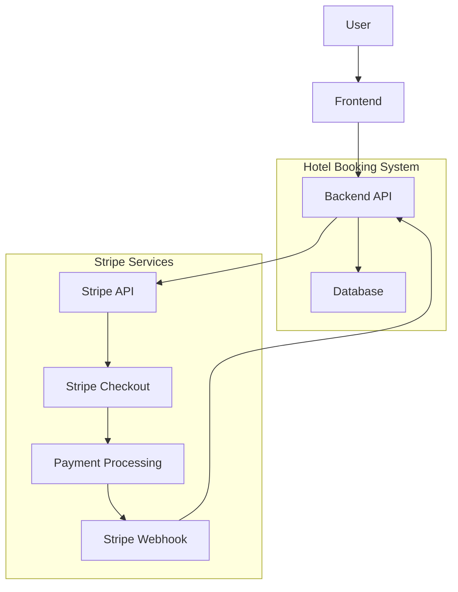
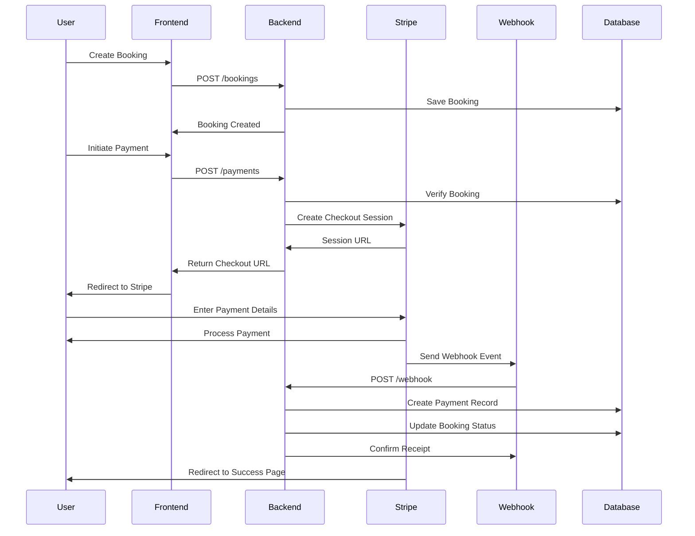

# 💳 Stripe Payment Integration - Hotel Booking System

A comprehensive guide to understanding how Stripe payments work in the Future Hotel Booking System.

## 📋 Table of Contents

- [Overview](#overview)
- [Stripe Architecture](#stripe-architecture)
- [Payment Workflow](#payment-workflow)
- [Implementation Details](#implementation-details)
- [API Endpoints](#api-endpoints)
- [Webhook Integration](#webhook-integration)
- [Security Considerations](#security-considerations)
- [Testing & Development](#testing--development)
- [Error Handling](#error-handling)
- [Troubleshooting](#troubleshooting)

## 🎯 Overview

The payment system uses **Stripe Checkout** to handle secure payment processing for hotel bookings. This integration provides:

- **Secure Payment Processing**: PCI-compliant payment handling
- **Multiple Payment Methods**: Credit cards, digital wallets
- **Real-time Payment Status**: Instant payment confirmations
- **Webhook Integration**: Automated payment status updates
- **Sri Lankan Rupee Support**: Native LKR currency handling

### Key Components

1. **Payment Controller**: Handles payment creation and management
2. **Stripe Checkout**: Hosted payment page
3. **Webhook Handler**: Processes payment events
4. **Payment Model**: Stores payment records
5. **Booking Integration**: Links payments to bookings

## 🏗️ Stripe Architecture



## 🔄 Payment Workflow

### Step-by-Step Process

#### 1. **Booking Creation** 🏨
```javascript
// User creates a booking first
POST /api/v1/bookings
{
  "roomId": "room_id_here",
  "startDate": "2024-02-15T00:00:00.000Z",
  "endDate": "2024-02-18T00:00:00.000Z"
}
```

#### 2. **Payment Initiation** 💳
```javascript
// User initiates payment for the booking
POST /api/v1/payments
{
  "bookingId": "booking_id_here",
  "amount": 599.97
}
```

#### 3. **Stripe Checkout Session Creation** 🔐
```javascript
// Backend creates Stripe checkout session
const session = await stripe.checkout.sessions.create({
  payment_method_types: ['card'],
  line_items: [{
    price_data: {
      currency: 'lkr',
      product_data: {
        name: 'Hotel Booking',
      },
      unit_amount: amount * 100, // Convert to cents
    },
    quantity: 1,
  }],
  mode: 'payment',
  success_url: 'http://localhost:3000/success',
  cancel_url: 'http://localhost:3000/cancel',
  client_reference_id: bookingId, // Link to booking
});
```

#### 4. **User Redirected to Stripe** 🌐
```javascript
// Response contains Stripe checkout URL
{
  "status": "success",
  "data": {
    "sessionId": "cs_test_...",
    "url": "https://checkout.stripe.com/c/pay/cs_test_..."
  }
}
```

#### 5. **Payment Processing** ⚡
- User enters payment details on Stripe's secure page
- Stripe processes the payment
- User redirected to success/cancel URL

#### 6. **Webhook Notification** 🔔
```javascript
// Stripe sends webhook to our server
POST /api/v1/payments/webhook
{
  "type": "checkout.session.completed",
  "data": {
    "object": {
      "id": "cs_test_session_id",
      "client_reference_id": "booking_id",
      "payment_intent": "pi_payment_intent_id",
      "amount_total": 59997
    }
  }
}
```

#### 7. **Payment Record Creation** 📝
```javascript
// Our webhook handler creates payment record
await Payment.create({
  bookingId: bookingId,
  amount: session.amount_total / 100,
  paymentMethod: 'card',
  transactionId: paymentIntent,
  paymentStatus: 'completed',
});

// Update booking status
await Booking.findByIdAndUpdate(bookingId, { 
  paymentStatus: 'completed' 
});
```

## 🔧 Implementation Details

### Payment Controller Structure

```javascript
// Controllers/PaymentController.js
const Payment = require('../Models/Payment');
const Booking = require('../Models/Booking');
const stripe = require('stripe')(process.env.STRIPE_SECRET_KEY);

exports.createPayment = async (req, res, next) => {
  // 1. Validate booking exists
  // 2. Create Stripe checkout session
  // 3. Return session URL to frontend
};

exports.stripeWebhook = async (req, res, next) => {
  // 1. Verify webhook signature
  // 2. Process payment completion
  // 3. Update database records
};
```

### Payment Model Schema

```javascript
// Models/Payment.js
const PaymentSchema = new mongoose.Schema({
  bookingId: {
    type: mongoose.Schema.Types.ObjectId,
    ref: 'Booking',
    required: true
  },
  amount: {
    type: Number,
    required: true
  },
  paymentMethod: {
    type: String,
    required: true
  },
  paymentDate: {
    type: Date,
    default: Date.now
  },
  transactionId: {
    type: String,
    required: true,
    unique: true
  },
  paymentStatus: {
    type: String,
    enum: ['pending', 'completed', 'failed'],
    default: 'pending'
  }
});
```

## 🔌 API Endpoints

### 1. Create Payment Session
```http
POST /api/v1/payments
Authorization: Bearer <jwt_token>
Content-Type: application/json

{
  "bookingId": "60f7b3b3b3b3b3b3b3b3b3b3",
  "amount": 599.97
}
```

**Response:**
```json
{
  "status": "success",
  "data": {
    "sessionId": "cs_test_a1n96Pq9TIAOR4cTRLdXyrmJcE6Q4Atqhu0lHwyDOfUsyfFCQqGY6nY9VO",
    "url": "https://checkout.stripe.com/c/pay/cs_test_...",
    "allData": {
      "id": "cs_test_...",
      "object": "checkout.session",
      "amount_total": 59997,
      "currency": "lkr",
      "status": "open",
      "success_url": "http://localhost:3000/success",
      "cancel_url": "http://localhost:3000/cancel"
    }
  }
}
```

### 2. Get All Payments
```http
GET /api/v1/payments
Authorization: Bearer <jwt_token>
```

### 3. Get Payment by ID
```http
GET /api/v1/payments/:id
Authorization: Bearer <jwt_token>
```

### 4. Update Payment
```http
PATCH /api/v1/payments/:id
Authorization: Bearer <jwt_token>
Content-Type: application/json

{
  "paymentStatus": "completed"
}
```

### 5. Delete Payment
```http
DELETE /api/v1/payments/:id
Authorization: Bearer <jwt_token>
```

## 🪝 Webhook Integration

### Webhook Endpoint Setup

```javascript
// Stripe webhook endpoint
POST /api/v1/payments/webhook
Content-Type: application/json
Stripe-Signature: t=timestamp,v1=signature
```

### Webhook Event Processing

```javascript
exports.stripeWebhook = async (req, res, next) => {
  const sig = req.headers['stripe-signature'];
  let event;

  try {
    // Verify webhook signature
    event = stripe.webhooks.constructEvent(
      req.body, 
      sig, 
      process.env.STRIPE_WEBHOOK_SECRET
    );
  } catch (err) {
    return res.status(400).send(`Webhook Error: ${err.message}`);
  }

  // Handle successful payment
  if (event.type === 'checkout.session.completed') {
    const session = event.data.object;
    const bookingId = session.client_reference_id;
    
    // Create payment record
    await Payment.create({
      bookingId: bookingId,
      amount: session.amount_total / 100,
      paymentMethod: 'card',
      transactionId: session.payment_intent,
      paymentStatus: 'completed',
    });

    // Update booking status
    await Booking.findByIdAndUpdate(bookingId, { 
      paymentStatus: 'completed' 
    });
  }

  res.status(200).json({ received: true });
};
```

### Supported Webhook Events

- `checkout.session.completed` - Payment successful
- `checkout.session.expired` - Payment session expired
- `payment_intent.payment_failed` - Payment failed

## 🔒 Security Considerations

### 1. **API Keys Protection**
```env
# Environment Variables
STRIPE_SECRET_KEY=sk_test_51Rc7KnQET8i16vJw...
STRIPE_WEBHOOK_SECRET=whsec_1234567890abcdef...
```

### 2. **Webhook Signature Verification**
```javascript
// Always verify webhook signatures
try {
  event = stripe.webhooks.constructEvent(
    req.body, 
    sig, 
    process.env.STRIPE_WEBHOOK_SECRET
  );
} catch (err) {
  return res.status(400).send(`Webhook Error: ${err.message}`);
}
```

### 3. **Amount Validation**
```javascript
// Validate payment amounts
const booking = await Booking.findById(bookingId).populate('roomId');
const expectedAmount = calculateBookingAmount(booking);

if (session.amount_total !== expectedAmount * 100) {
  throw new Error('Payment amount mismatch');
}
```

### 4. **Idempotency**
```javascript
// Prevent duplicate payment processing
const existingPayment = await Payment.findOne({
  transactionId: session.payment_intent
});

if (existingPayment) {
  return res.status(200).json({ received: true });
}
```

## 🧪 Testing & Development

### Test Mode Configuration

```env
# Use test keys for development
STRIPE_SECRET_KEY=sk_test_51Rc7KnQET8i16vJw...
STRIPE_PUBLISHABLE_KEY=pk_test_51Rc7KnQET8i16vJw...
```

### Test Credit Cards

```javascript
// Stripe test card numbers
const testCards = {
  success: '4242424242424242',
  declined: '4000000000000002',
  insufficient_funds: '4000000000009995',
  expired: '4000000000000069'
};
```

### Webhook Testing with Stripe CLI

```bash
# Install Stripe CLI
stripe login

# Forward webhooks to local server
stripe listen --forward-to localhost:3000/api/v1/payments/webhook

# Trigger test webhook
stripe trigger checkout.session.completed
```

### Testing Workflow

1. **Create a booking** using the booking API
2. **Initiate payment** with the booking ID
3. **Visit Stripe checkout URL** from the response
4. **Use test card numbers** to simulate different scenarios
5. **Verify webhook** receives the payment completion event
6. **Check database** for payment and booking status updates

## ⚠️ Error Handling

### Common Error Scenarios

#### 1. **Invalid Booking ID**
```json
{
  "status": "error",
  "message": "No booking found with that ID"
}
```

#### 2. **Webhook Signature Verification Failed**
```json
{
  "status": "error",
  "message": "Webhook Error: Invalid signature"
}
```

#### 3. **Payment Processing Failed**
```json
{
  "status": "error",
  "message": "Your card was declined"
}
```

#### 4. **Duplicate Payment**
```json
{
  "status": "error",
  "message": "Payment already processed for this booking"
}
```

### Error Response Format

```javascript
// Standardized error response
{
  "status": "error",
  "statusCode": 400,
  "message": "Detailed error message",
  "error": {
    "type": "StripeCardError",
    "code": "card_declined",
    "decline_code": "insufficient_funds"
  }
}
```

## 🔍 Troubleshooting

### Common Issues & Solutions

#### 1. **Webhook Not Receiving Events**
```bash
# Check webhook endpoint URL
curl -X POST http://localhost:3000/api/v1/payments/webhook

# Verify webhook secret in Stripe Dashboard
# Ensure server is accessible from internet (use ngrok for local testing)
```

#### 2. **Payment Amount Mismatch**
```javascript
// Debug amount conversion
console.log('Frontend amount:', amount);
console.log('Stripe amount (cents):', amount * 100);
console.log('Webhook amount:', session.amount_total);
```

#### 3. **Database Connection Issues**
```javascript
// Check MongoDB connection
mongoose.connection.readyState === 1 // Connected
```

#### 4. **Authentication Errors**
```javascript
// Verify JWT token in payment requests
const token = req.headers.authorization?.split(' ')[1];
const decoded = jwt.verify(token, process.env.JWT_SECRET);
```

### Debugging Tools

#### 1. **Stripe Dashboard**
- View all payments and sessions
- Monitor webhook deliveries
- Check event logs

#### 2. **Server Logs**
```javascript
// Add logging to payment controller
console.log('Creating payment for booking:', bookingId);
console.log('Stripe session created:', session.id);
console.log('Webhook received:', event.type);
```

#### 3. **Database Queries**
```javascript
// Check payment records
db.payments.find({ bookingId: ObjectId("...") });

// Check booking status
db.bookings.find({ _id: ObjectId("...") });
```

## 📊 Payment Flow Diagram



## 🚀 Production Deployment

### Environment Setup

```env
# Production environment variables
NODE_ENV=production
STRIPE_SECRET_KEY=sk_live_...
STRIPE_WEBHOOK_SECRET=whsec_...
```

### Webhook URL Configuration

```bash
# Production webhook endpoint
https://your-domain.com/api/v1/payments/webhook
```

### SSL Certificate

```bash
# Ensure HTTPS for webhook endpoints
# Stripe requires HTTPS for production webhooks
```

### Monitoring

```javascript
// Add payment monitoring
const paymentMetrics = {
  totalPayments: await Payment.countDocuments(),
  successfulPayments: await Payment.countDocuments({ paymentStatus: 'completed' }),
  failedPayments: await Payment.countDocuments({ paymentStatus: 'failed' }),
  totalRevenue: await Payment.aggregate([
    { $match: { paymentStatus: 'completed' } },
    { $group: { _id: null, total: { $sum: '$amount' } } }
  ])
};
```

## 📈 Analytics & Reporting

### Payment Analytics

```javascript
// Monthly payment report
const monthlyPayments = await Payment.aggregate([
  {
    $match: {
      paymentStatus: 'completed',
      paymentDate: {
        $gte: new Date(new Date().getFullYear(), new Date().getMonth(), 1)
      }
    }
  },
  {
    $group: {
      _id: { $dayOfMonth: '$paymentDate' },
      totalAmount: { $sum: '$amount' },
      count: { $sum: 1 }
    }
  }
]);
```

### Revenue Tracking

```javascript
// Daily revenue calculation
const dailyRevenue = await Payment.aggregate([
  {
    $match: {
      paymentStatus: 'completed',
      paymentDate: {
        $gte: new Date(new Date().setHours(0, 0, 0, 0))
      }
    }
  },
  {
    $group: {
      _id: null,
      totalRevenue: { $sum: '$amount' },
      totalTransactions: { $sum: 1 }
    }
  }
]);
```

## 📚 Additional Resources

- [Stripe API Documentation](https://stripe.com/docs/api)
- [Stripe Checkout Guide](https://stripe.com/docs/checkout)
- [Webhook Best Practices](https://stripe.com/docs/webhooks/best-practices)
- [Testing with Stripe](https://stripe.com/docs/testing)

---

**💡 Pro Tips:**

1. **Always test webhooks** in development before deploying
2. **Use idempotency keys** for critical operations
3. **Monitor webhook delivery** in Stripe Dashboard
4. **Implement retry logic** for failed webhook processing
5. **Keep payment records** for audit and reconciliation
6. **Use test mode** extensively before going live

**Happy Payment Processing! 🎉**
